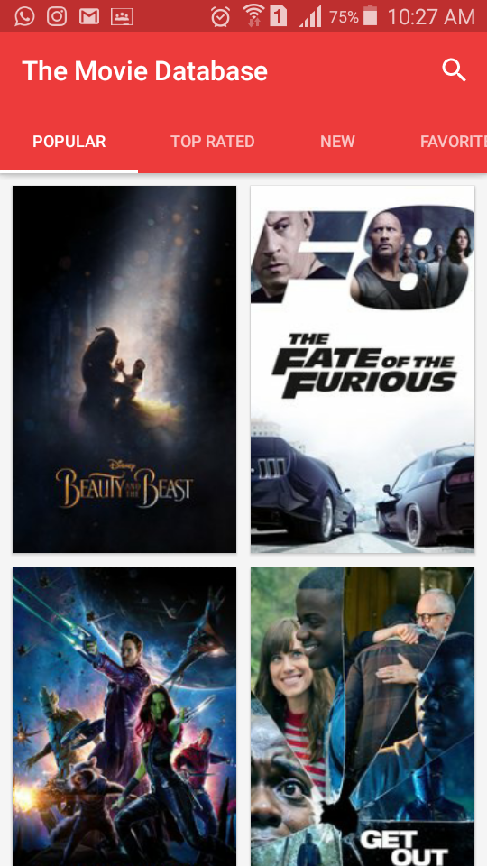
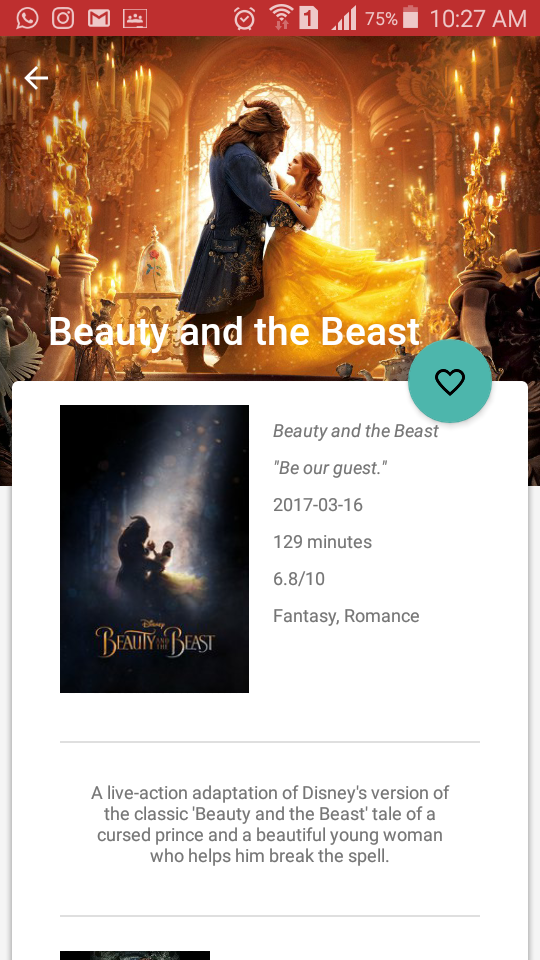
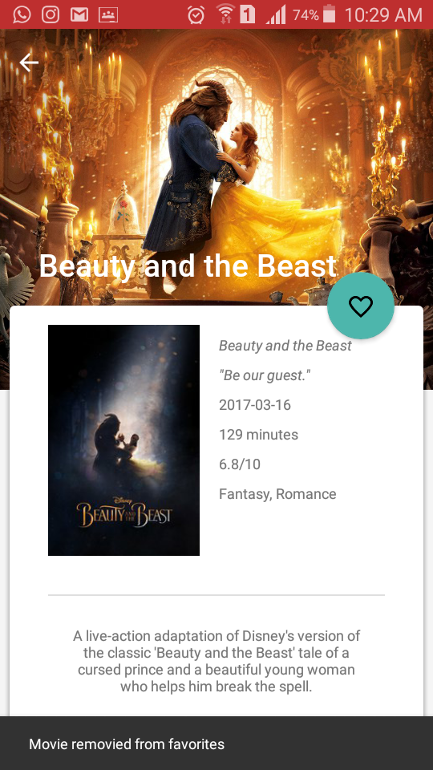
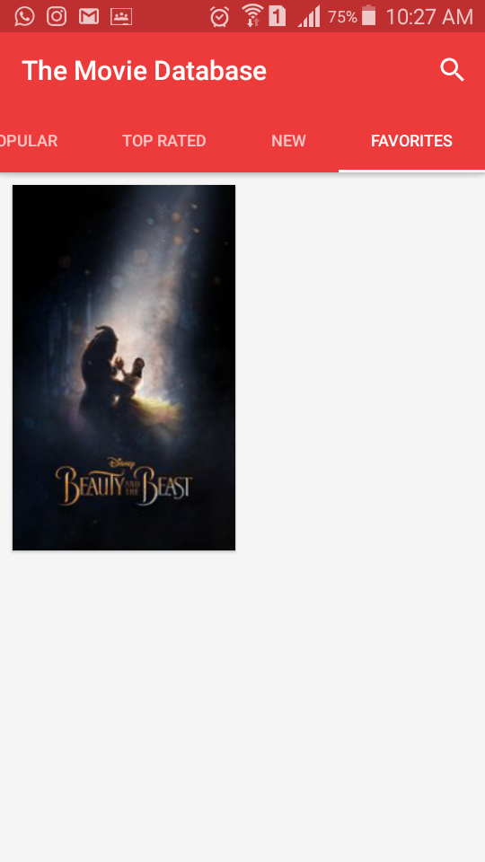
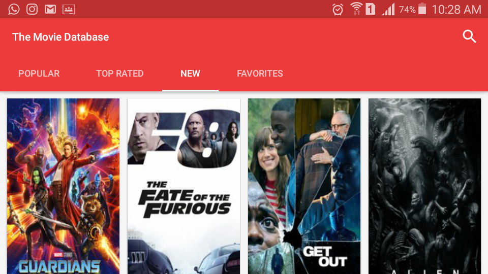

# The-Movie-Database

Link File APK release : 

Nama Lengkap : Savina Ramadhani Putri T

Kelas / No Urut : XIRPL3 / 31

NIS : 4828/1547/070

Angkatan : 24

Nama Sekolah : SMK Telkom Malang

# Tentang The Movie Database 

API yang digunakan : https://www.themoviedb.org/

Navigasi yang digunakan : Navigasi Swipe View

Deskripsi : Aplikasi Android yang memungkinkan Anda melihat film terpopuler, baru, dan paling atas, dan Anda dapat membaca plot dan ulasan film. Ini juga memungkinkan Anda menjadikan favorit sebuah film.

Kelebihan Aplikasi :

- Pengguna dapat menelusuri film terkini dari API Database Film

- Jika pengguna menggulir kebawah dan mencapai akhir daftar, halaman film berikutnya akan dimuat

- Memungkinkan pengguna untuk mencari film dengan action search

- User Interface yang menarik bagi pengguna

- Memungkinkan pengguna menjadikan favorit sebuah film

- Memungkinkan pengguna untuk rotate screen tanpa takut tampilannya akan kacau

Library yang digunakan : CardView, Picasso, RecyclerView, ButterKnife, dll

# Screenshoot Hasil Aplikasi

Screenshoot1 - Saat aplikasi pertama dibuka, maka akan muncul tampilan seperti dibawah ini :

Screenshoot2 - Jika gambar daftar film yang awal diklik maka akan masuk ke detail film itu sendiri, contohnya sbg berikut :

Screenshoot3 - Pengguna dapat menambahkan film ke dalam menu favoritenya dengan cara klik bentuk hati tersebut

Screenshoot4 - Pengguna dapat me-remove film favoritenya dengan cara klik bentuk hati tersebut

Screenshoot5 - Jika pengguna menambahkan film ke dalam menu favoritenya maka otomatis film yang dipilih akan masuk ke menu Favorites

Screenshoot6 - Tidak perlu khawatir, pengguna juga dapat rotate screen semaunya tanpa takut tampilannya akan berubah

